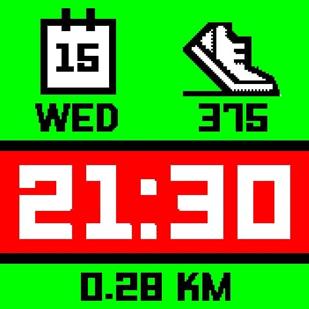
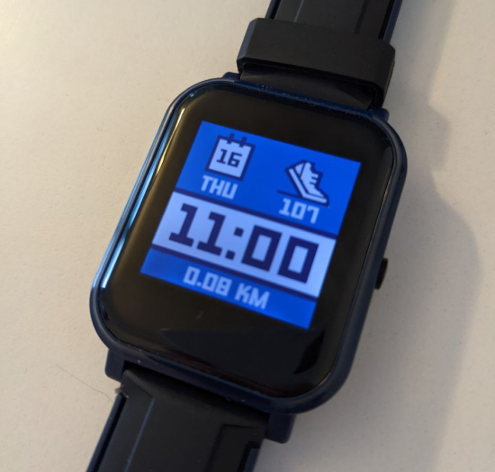

# Pebble with battery indicator

- Forked from [Pebbled](https://github.com/espruino/BangleApps/tree/master/apps/pebbled)
- Added battery indicator
- Battery warning changed to 15% instead of 30%

Pebble initially written by: [Hugh Barney](https://github.com/hughbarney)
PebbleD created by [RomanistHere](https://github.com/RomanistHere)
Fork created by [Michael Haszprunar](https://github.com/mhaszprunar)

For support and discussion please post in the [Bangle JS Forum](http://forum.espruino.com/microcosms/1424/)

## How the battery indicator works
I always wanted to check on the battery level (bit paranoid I guess) but I want to have it very minimalistic and gracefully integrated with the Pebble look.
I opted for a series of rectangles each representing 10% of battery capacity and color coding instead of the standard battery icon style. Each of the 10 blocks contains two sections, so 5% battery capacity can be visualized.
In the settings you can optionally activate to also show the battery level as number.

## Plans
none at the moment
